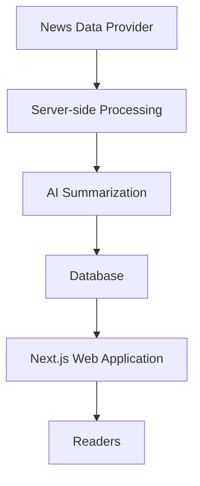

# ARUSnya — Indonesian News Summarization Platform

ARUSnya is a non-commercial news platform that transforms a curated selection of global and Indonesian reporting into concise Indonesian-language summaries, helping readers discover news while preserving attribution to original publishers.

**Live Website:** https://arusnya.my.id

## Overview

ARUSnya combines automated news collection, AI-assisted summarization, and a responsive web interface to make international reporting more accessible to Indonesian readers.

The platform is designed around three principles:
- **Accessibility:** Present news from different source languages in Indonesian.
- **Transparency:** Attribute original publishers and link back to source articles.
- **Efficiency:** Automate content processing and serve stored results to website visitors.

## Tech Stack

- **Frontend & Framework:** Next.js, React, TypeScript
- **Database:** Supabase / PostgreSQL
- **AI Processing:** Groq
- **News Data:** GNews API
- **Deployment:** Vercel
- **Automation:** Scheduled background jobs

## Key Features

- Automated news ingestion and duplicate detection
- AI-assisted Indonesian translation and summarization
- Automatic article categorization
- Search and category-based browsing
- Paginated article listings
- Responsive user interface
- SEO metadata, sitemap, and social sharing metadata
- Original publisher attribution and source links

## Architecture

The platform uses a server-side processing pipeline to collect news, generate Indonesian summaries, and store processed articles for delivery through the web application.

## Engineering Highlights

- Server-side integration with external data and AI services
- Structured data validation and error handling
- Automated processing with bounded retries
- Database-backed content delivery
- Search, pagination, and SEO implementation
- Separation of public data access from privileged server operations

## Project Status

ARUSnya is a non-commercial project built to explore automated news processing, AI-assisted content transformation, and modern full-stack web development.

Visit the live website to explore the project.

---

*This repository presents a public overview of the project. Internal implementation details and private configuration are maintained separately.*
