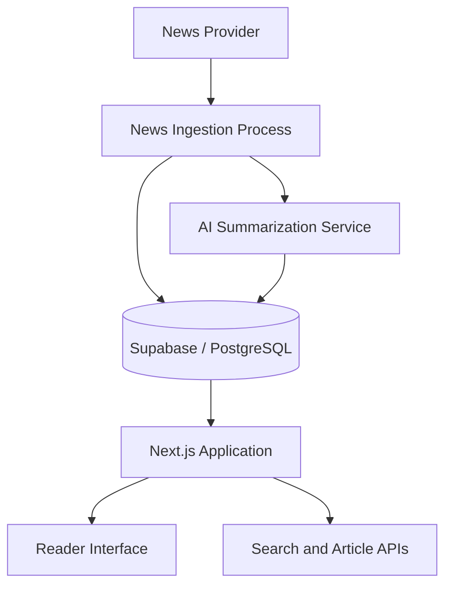

# Architecture — ARUSnya

## Overview

ARUSnya is an AI-assisted news summarization platform designed to make global and Indonesian news more accessible to Indonesian readers.

The system combines a web application, a news data provider, AI-generated summaries, and a database for storing and retrieving article data.

## High-Level Architecture

## Main Components

### Web Application
- Built with Next.js App Router.
- Renders the user interface and handles application routes.
- Provides access to news articles and summaries.

### News Data Provider
- Supplies source news data to the ingestion process.
- Article availability and metadata depend on the provider.

### AI Summarization
- Uses a language model to generate Indonesian-language summaries.
- Generated content should be treated as a summary of the source, not a replacement for the original reporting.

### Database
- Supabase with PostgreSQL stores application data.
- Supports article retrieval and related application features.

### Deployment and Automation
- The application is deployed using Vercel.
- Scheduled tasks support automated news ingestion.

## Data Flow

1. The ingestion process retrieves news from the configured provider.
2. Article content is processed for summarization.
3. Article data and summaries are stored in the database.
4. The Next.js application retrieves data for readers.
5. Readers browse and search the available news.

## Security Considerations

- API credentials and service-role keys are stored in environment variables.
- Private credentials must never be committed to a public repository.
- Database access should follow the principle of least privilege.
- Scheduled endpoints should use appropriate authentication.

## Scope

This document describes the system at a high level. Internal implementation details, private source code, and production credentials are intentionally excluded.
